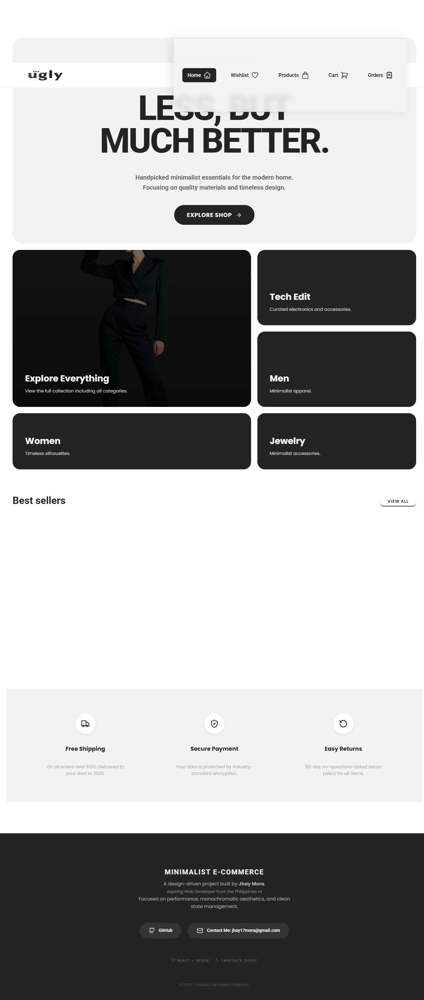
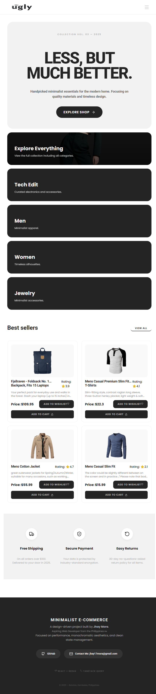
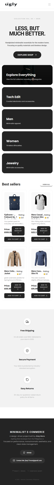

## 📸 Preview

## ✨ Key Features
- **Typographic Hero:** A bold, no-image hero section for a premium aesthetic.
- **Bento Grid Navigation:** A modern 5-card category system.
- **Responsive Checkout:** A professional 2-column flow optimized for mobile.
- **Wishlist Logic:** Fully managed via Redux with exit animations.
- **Framework:** React 18
- **State Management:** Redux Toolkit
- **Data Fetching:** TanStack Query (React Query)

- ** this project is the first one ive finished since learning react.
- ** before react ive been using vanilla html and practicing building a project from free figma web designs
- ** This project represents 14 days of intensive learning the basics of modern e-commerce UI patterns.

[Contact Me](mailto:jhay17mora@gmail.com)
